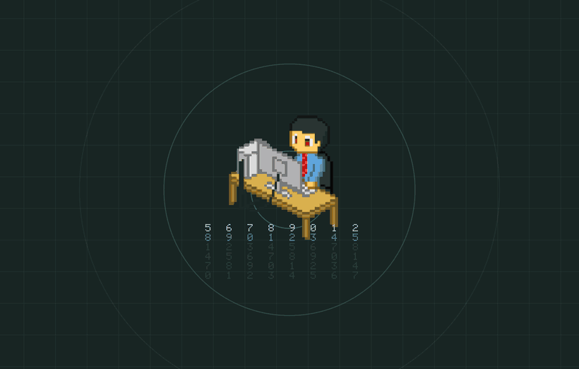

# hyper-loader

[](https://github.com/sgomezsal/hyper-loader/actions/workflows/ci.yml)
[](LICENSE)
[](https://wayland.app/protocols/wlr-layer-shell-unstable-v1)

A native Wayland overlay, built directly on `wlr-layer-shell`, meant to be
shown while a long-running command executes — the motivating use case is
masking the few seconds a `nixos-rebuild switch --specialisation <name>`
takes, so switching between NixOS specialisations feels instant instead of
leaving you staring at a frozen desktop. It works just as well for `ansible-playbook`,
a deploy script, a slow `hyprctl reload`, or anything else where you'd
rather show a deliberate "working…" screen than let the compositor freeze
mid-frame.



It draws a fullscreen overlay layer (`Layer::Overlay`, no keyboard
interactivity, `exclusive_zone = -1`) — **on every connected output**, not
just whichever one the compositor picks — with:

- a blurred screenshot of the desktop as a backdrop (fed in via a watched
  file, see below), fading in under the overlay decorations
- an animated grid, corner brackets and pulsing rings in a configurable
  accent color
- an optional looping GIF centered on screen
- an optional scrolling "digit rain" counter
- an optional scanline/glitch flicker effect

Everything above is configurable via CLI flags or a TOML config file (CLI
wins when both are set) — see [Usage](#usage) and
[Config file](#config-file).

It works with **any** wlroots-based compositor that implements
`zwlr_layer_shell_v1` — Hyprland, Sway, river, Wayfire, labwc, and so on.
Nothing here is Hyprland-specific; it's a plain Rust + `smithay-client-toolkit`
Wayland client, so it fits alongside `hyprlock`, `hypridle`, `hyprpaper`, or
their non-Hyprland equivalents without pulling in any Hyprland IPC.

## Why not just a shell script + `swaylock`-style tool?

Because the point is a *non-blocking*, click-through overlay that composites
live over your desktop while a command runs in the background — not a lock
screen. The blur-then-fade-in of the actual desktop is what makes the
transition feel intentional rather than like a frozen screen.

## Installation

### Nix (flake)

```bash
nix run github:sgomezsal/hyper-loader -- --help
```

Or add it as a flake input and reference `packages.<system>.default` /
`self.inputs.hyper-loader.packages.${pkgs.system}.default` from your own
flake — see `flake.nix` for the exposed outputs. There's also a
`devShells.default` with the exact Rust toolchain (plus `rustfmt`/`clippy`)
this project is developed against:

```bash
nix develop
```

### From source (any distro)

You need a C toolchain, `pkg-config`, and the `wayland` and `libxkbcommon`
development headers:

```bash
# Arch / EndeavourOS / Manjaro
sudo pacman -S --needed wayland libxkbcommon pkgconf

# Fedora
sudo dnf install wayland-devel libxkbcommon-devel pkgconf-pkg-config

# Debian / Ubuntu
sudo apt install libwayland-dev libxkbcommon-dev pkg-config
```

Then build with Cargo:

```bash
cargo build --release
./target/release/hyper-loader --help
```

A `man` page (`man/hyper-loader.1`) is included and installed automatically
by both the Nix package and [`packaging/PKGBUILD`](packaging/PKGBUILD) — a
ready-to-submit Arch package build recipe. It's not published to the AUR
yet; if you want to be the one to push it there, see
[CONTRIBUTING.md](CONTRIBUTING.md).

## Usage

```
hyper-loader [OPTIONS]

Options:
  --accent <HEX>             Primary accent color, e.g. "7ed4c8" (default: 7ed4c8)
  --accent2 <HEX>             Secondary accent for grid/corners/pulse (default: same as --accent)
  --gif <PATH>                 GIF to loop in the center of the overlay
  --fade-ms <MS>               Fade-in duration for the decorations (default: 300)
  --no-counter                  Disable the scrolling digit counter
  --glitch                       Enable scanline + glitch flicker over the background
  --overlay-alpha <0.0-1.0>   Darkness of the overlay drawn over the blurred screenshot (default: 0.55)
  --config <PATH>             Path to a TOML config file (default: see below)
```

Full flag docs (with defaults) are also available via `hyper-loader --help`
or `man hyper-loader`.

### Config file

Every flag above can also be set in a TOML config file, so you don't have
to repeat the same flags in every wrapper script. Precedence is
**CLI flag > config file > built-in default**. hyper-loader looks for, in
order: the path passed via `--config`; then
`$XDG_CONFIG_HOME/hyper-loader/config.toml`; then
`~/.config/hyper-loader/config.toml`. A missing default config is not an
error — an explicitly-passed `--config` path that doesn't exist is (it
prints a warning and falls back to defaults, it doesn't hard-fail).

```toml
# ~/.config/hyper-loader/config.toml
accent = "7ed4c8"
accent2 = "b072d1"
fade_ms = 300
gif = "/home/me/.config/hyper-loader/loading.gif"
no_counter = false
glitch = false
overlay_alpha = 0.55
```

See [`examples/config.toml`](examples/config.toml) for a fully-commented
version of the same file.

### Feeding it a background screenshot

`hyper-loader` polls for a file at `/tmp/hyper-loader-bg.png`. If present when
it starts, it loads, box-blurs, and fades it in as the backdrop, then deletes
the file. Typical usage is to `grim` a screenshot right before launching it:

```bash
grim /tmp/hyper-loader-bg.png
hyper-loader --accent 7ed4c8 &
LOADER_PID=$!
# ... wait for /tmp/hyper-loader-ready to appear, run your real command ...
kill "$LOADER_PID"
```

If you're not on a wlroots compositor with `grim`, any tool that writes a
PNG to that path works the same way.

### Readiness signal

Once the layer surface is configured (i.e. actually visible), `hyper-loader`
writes `/tmp/hyper-loader-ready`. Callers that spawn it in the background can
poll for that file to know it's safe to start the real work without a visible
flash of the plain desktop.

## Examples

[`examples/switch-specialisation.sh`](examples/switch-specialisation.sh) is a
complete, ready-to-adapt example wiring `hyper-loader` into
`nixos-rebuild switch --specialisation`, including per-specialisation accent
colors and an optional glitch effect. It also references three small
pixel-art GIFs under [`examples/assets/`](examples/assets/) (`work.gif`,
`relax.gif`, `anon.gif`) purely as sample material for the `--gif` flag —
swap in whatever fits your own workflow, or drop `--gif` entirely.

```bash
./examples/switch-specialisation.sh work /path/to/your/flake
```

## How it works

`hyper-loader` is a straightforward `smithay-client-toolkit` client:

1. Binds `wl_compositor`, `wl_shm`, and `zwlr_layer_shell_v1`, then does an
   initial roundtrip so `OutputState` reports every output already
   connected. For each one — at startup and for anything hotplugged later
   — it creates its own `Layer::Overlay` surface pinned to that specific
   output, anchored to all four edges with `exclusive_zone = -1` (so it
   doesn't reserve space or shift other windows) and
   `KeyboardInteractivity::None` (so it never steals focus). This is what
   makes the overlay cover every monitor on a multi-monitor setup instead
   of whichever one the compositor happens to pick.
2. As each surface's first `configure` event arrives, it writes the
   readiness file and starts an animation loop driven by that surface's own
   `wl_surface.frame` callbacks — everything is drawn CPU-side with
   [`tiny-skia`](https://github.com/RazrFalcon/tiny-skia) into a `wl_shm`
   buffer sized for that output and re-committed every frame. Decorative
   state (accent colors, GIF frames, elapsed time) is shared across all
   outputs so they animate in sync.
3. A background thread watches for `/tmp/hyper-loader-bg.png`, box-blurs it
   in three passes once it appears, and hands the result to the render loop
   to cross-fade in on every surface.
4. An optional GIF is decoded once at startup (via the `image` crate) and
   the correct frame is picked each redraw based on elapsed time and each
   frame's own delay, so playback speed matches the source GIF regardless of
   the overlay's own frame rate.
5. If an output is unplugged, its surface is torn down and removed; if the
   last one goes away, the process exits.

## Contributing

Bug reports, compositor-compatibility reports, and small focused PRs are
welcome — see [CONTRIBUTING.md](CONTRIBUTING.md) for the dev setup, the
`fmt`/`clippy`/`build` checks CI runs, and what's in vs. out of scope for
this project.

## License

MIT — see [LICENSE](LICENSE).
